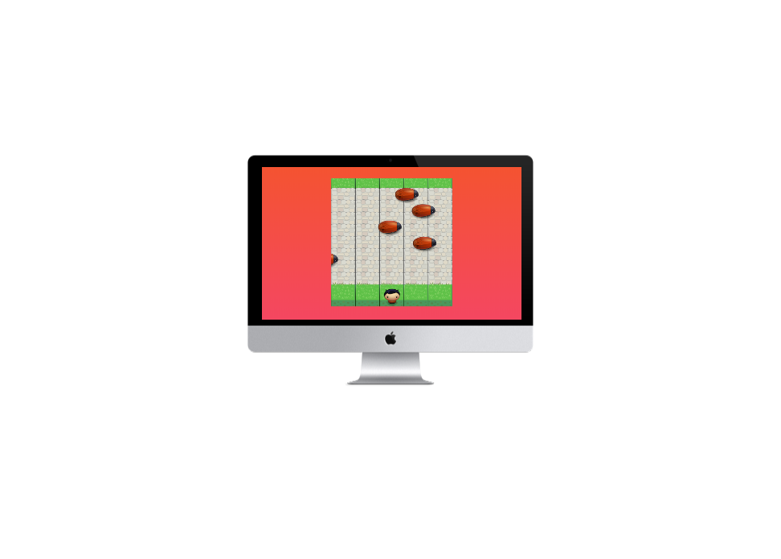

# Udacity Arcade Game Project

Arcade game is built by `Javacsript`
 on the web using latest version of the language 

and *Canvas API*

The project is composed of two *sections* or *parts*



WEB Version
---

#### Installing

```shell
// clone the project
$  git clone https://github.com/hosamsam/arcade-game.git

// list the branches
$  git branch -v -a

// branch *gh-pages* is for hosting the game

$ git checkout gh-pages

```

after you are on the right branch and project

you can install it's dependencies by

```shell
$ npm install
```

now yo can review the code and send me feedbacks


```shell

$ npm start  // for local-server-live-reload

$ npm webpack // simplest webpack js bundler if you had edited the code

```


#### CONTRIBUTING

*SOON*


App Version 
---