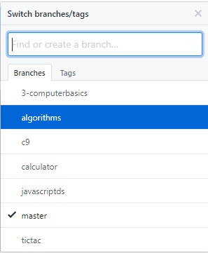

# Free Code Camp 

*check repo branches*

## (1) Front End Development Certification

* Basic Front End Development Projects

* JQuery

* Basic Javascript

* Object Oriented and Functional Programming

* Basic Algorithm Scripts

* JSON Api and Ajax

* Intermediate Front End Development Projects

* Intermediate Algorithm Scripting

* Advanced Algorithm Scripting

* Advanced Front End Development Projects

## (2) Back End Development Certification

* GIT

* Nodejs and Express.js

* MongoDB

* API Projects

* Dynamic Web Applications Projects

## (3) Video Challlenges

* Computer Basics

* The Dom

* Chrome Developer Tools

# (4) Coding Interview Preparation

* Coding Interview Training

* Mock Interviews

